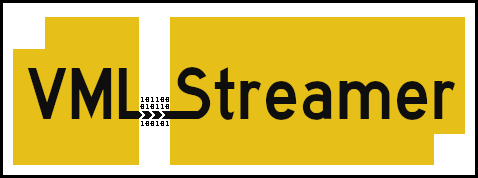
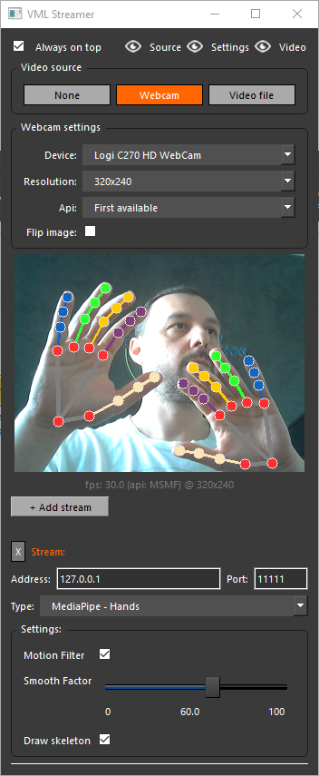
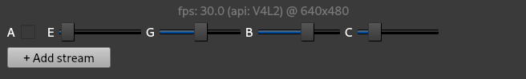

<!-- Splash logo

-->

# VML_Streamer (Qt)
Vision and Machine Learning data streamer for 
[SideFX Houdini](https://www.sidefx.com/). (Intended use video [here](https://www.youtube.com/watch?v=AqozqMFU_kg))

 Version
---

## How it works:

It streams data through UDP sockets. You can stream to different machines on a 
network by defining ip/port pairs for each stream.

Video is sent as a flattened numpy array (0-255 RGB values)<br/>
Data is sent as a json string (dumped python dict)

\**This program was made as a utility tool for Sidefx Houdini, but nothing 
stops you from using it as a generic data server to feed your 
own udp client that decodes the data.*

# Installation

## Virtual environment setup:
Note: `pip install -r requirements.txt` can potentially give you errors 
(due to how specific OpenCV versions were frozen on Windows/Linux machines).

So consider recreating your virtual environment by hand:  
*(Tested on Python 3.10.\*)*

	# navigate to main dir
	cd VML_Streamer_QT

	# create venv
	python -m venv venv

	# activate venv
	source venv/bin/activate # on Linux
	venv/Scripts/activate    # on Windows
	
	# install modules ("pyinstaller" only needed if you'll build binaries)
	pip install opencv-python mediapipe PySide6 pyinstaller

## Running:

	# after venv activated, run main program
	cd vml-streamer
	python main.py

<br/><br/>

<br/><br/>

---

# Adding custom stream types

VML Streamer was created in a way that adding new stream types 
is simple and intuitive. Stream types are defined as simple classes, 
living inside their own python files.

## Step 1 - add your "st_[name].py" file

As an example, let's pretend we want to stream [vive 
tracker](https://www.vive.com/us/accessory/tracker3) positions: 

Create a file named "st_vive.py" inside the *vml-streamer* folder. 

```python 
class ViveStream:
	def __init__(self):
		...
```

## Step 2 - add main properties

Create a label and optionally extra configuration fields for your new stream type.

```python
class ViveStream:
	def __init__(self):
		self.label = 'Vive Tracker'
		self.description = 'Streams vive tracker positional data.'  

		# you can add extra fields as a list of dicts
		self.settings = [

			# a checkbox
			{
				'name': 'enable_mult',
				'label': 'Multiply values',
				'description': 'When checked, it will mult tracker positions by some number',
				'type': bool,
				'default_value': True,
			},
			
			# a slider
			{
				'name': 'mult_value',
				'label': 'Value',
				'description': 'Multiplication factor',
				'type': float,
				'default_value': 3,
				'min_value': 0,
				'max_value': 10,
			},

			# a text field
			{
				'name': 'extra_text',
				'label': 'Extra text',
				'description': 'Some custom text that is sent together with the tracker position.',
				'type': str,
				'default_value': 'This is a custom string.',
			},

		]
```

## Step 3 - define a "run()" method

This is the main method where you return data to be sent through sockets. 
Return types available:
 - *dict*: sent as a dumped json string
 - *numpy array*: sent as a video frame (flattened list of uint8: 0-255 rgb values)

```python
class ViveStream:
	def __init__(self):
		...

	def run(self, video, stream, streams):

		# video: The video object with information about current frame being displayed in the UI
		# stream: The current stream instance being processed. 
		# streams: A list of all stream instances being processed (including self!). You can use this list to access other streams if needed. 
		
		# access property values defined at __init__()
		settings = stream['settings']
		
		# dummy data, but assume this would query a position from a Vive tracker
		data = {
			'X': 1.5,
			'Y': 2.3,
			'Z': 0.7,
			'text':  settings['extra_text'],
		}

		# logic
		if settings['enable_mult']:
			data['X'] *= settings['mult_value']
			data['Y'] *= settings['mult_value']
			data['Z'] *= settings['mult_value']

		# optionally access video input properties:
		# video.imageRGB
		# video.resolution
		# video.frame
		# video.source_file
		# etc...

		# you can also annotate the current image being displayed in the UI by 
		# overriding "video.imageDISPLAY" with a numpy array
		# (make sure to keep array shape the same as the original image)

		# here we are simply bypassing the display image:
		# video.imageDISPLAY = video.imageRGB

		# finally, return the dict data to be sent through UDP connection
		return data
```

That's it! now you should see a new stream type in the UI.

Check *vml-streamer/_st_stream_template.py* for a complete documented example!

---


# Building a binary file with PyInstaller

## Files and folders
- vml-streamer/main.spec file is already provided to facilitate the build process.
- The .spec file is setup to generate a single executable (i.e.: "one-file" option, no installation required!)
- If you add custom stream types, use the "models" subfolder to store extra required bin files. They all get included in the final executable.
- Because one-file is used, all depdendencies get extracted to a temp folder at runtime. You will NOT be able to use relative paths to, for example, load a binary file from "models". Instead, please "import resources" and get the absolute path by using "resources.getPath('./models/my-resource.ext')"

## Building
To build the executable just activate your venv in a terminal, then run:

	cd vml-streamer
	pyinstaller main.spec

File will be saved inside *vml-streamer/dist* folder

## Troubleshooting

* Windows and pywintypes:
If you're having errors related to pywintypes, try disabling your anti-virus! Windows can flag "pywintypes" as virus for some reason.

* Custom stream types and "python module not found" errors:

Before building, make sure to run:

vml-streamer/rebuild_stream_types.bat (if on Windows)

vml-streamer/rebuild_stream_types.sh  (if on Linux)

Because of the dynamic nature of how the stream types are read by the main app, 
this will ensure pyinstaller includes all necessary .py files during the build.

---

# VML Streamer Known limitations

- Video playback can be slow and not match file's source FPS. This in being fixed at the moment! For now use the video speed to get faster playback.
- "ffmpeg" needs to be installed (and available on path!) for OBS virtual camera to work on Windows! 
VML Streamer is based on Qt for its user interface. Qt uses the QMediaDevices class to acquire available webcams, but recently Qt6 removed support for Direct Show device listing on windows. Since OBS Virtual camera uses Direct Show, the alternative way of detecting the device is through ffmpeg.

- Error "*Corrupt JPEG data: 1 extraneous bytes before marker 0xd3*" printed to stdout:
This can happen on Linux machines reading logitech webcams. 
(This is a problem related to libjpeg, as stated [here](https://github.com/opencv/opencv/issues/9477#issuecomment-390679150), and should not compromise the program functionality)

#  Tips for Linux users

## Increasing webcam fps
The v4l2 camera exposure setting has a big impact on fps. Often times you might want
to turn off "auto exposure" and lower the manual exposure setting. To compensate for the darker image, 
increase gain/brightness and you should now have a much faster camera read speed.


<span style="font-size:10pt;">A=auto exposure, E=exposure, G=gain, B=brightness, C=contrast</span>

Doing this I've been observing gains from 15 fps -> 30 fps (or more, depending on the webcam hardware!).
